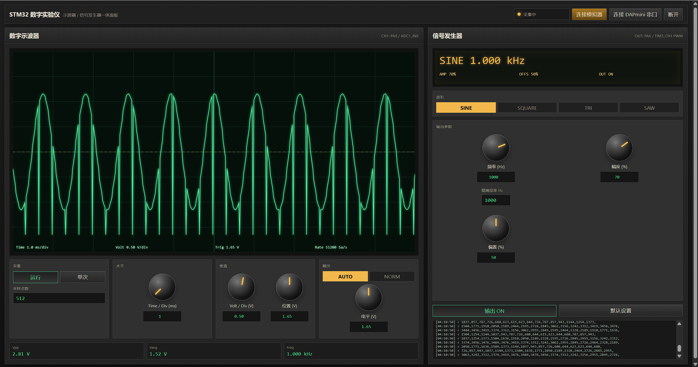
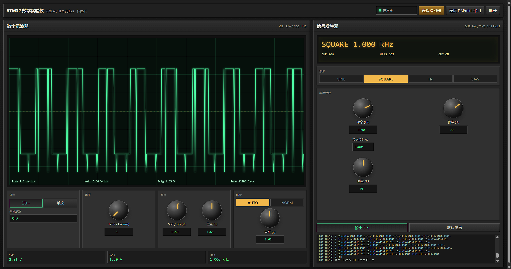
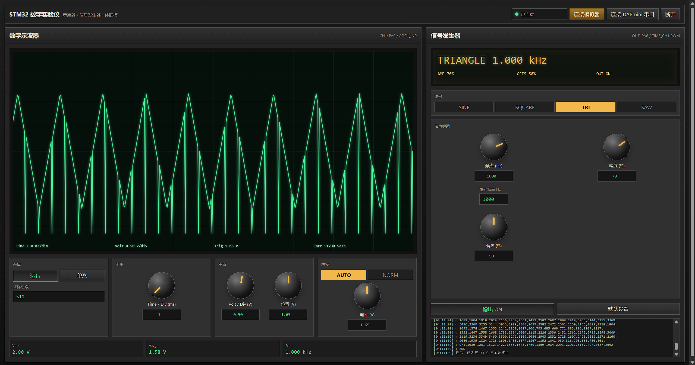
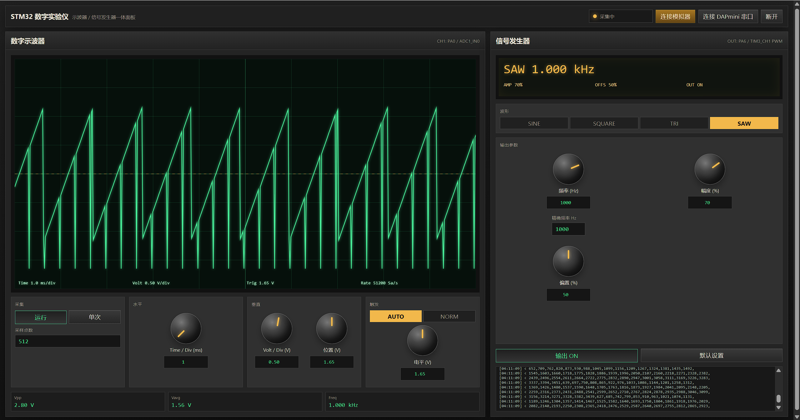
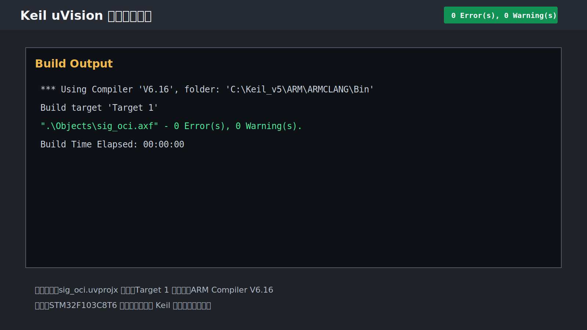
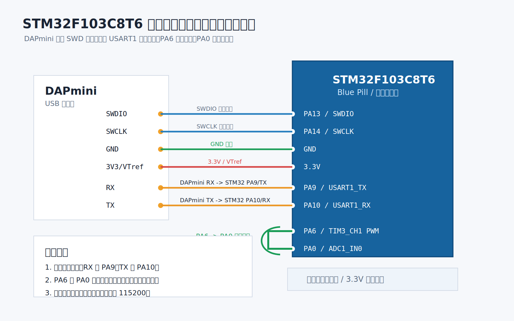
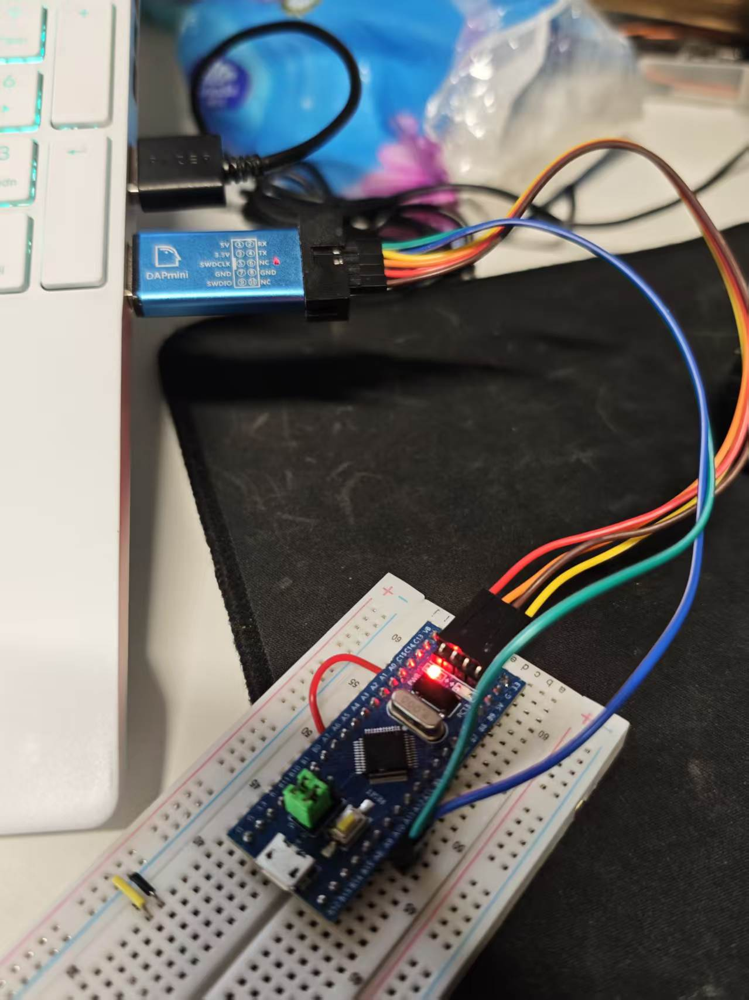

# STM32F103C8T6 简易信号发生器与示波器

## 1. 项目介绍

本项目基于 `STM32F103C8T6` 单片机，实现一个简易的“信号发生器 + 示波器”综合实验系统。系统由三部分组成：

- 上位机软件：`instrument_panel.html`，采用 HTML 仪器面板形式，操作方式接近真实示波器和信号发生器。
- 下位机单片机程序：`sig_oci.uvprojx` Keil 工程，运行在 STM32F103C8T6 上，负责 PWM 信号输出、ADC 采样和串口通信。
- 下位机单片机模拟器：`mcu_simulator.py`，用于在没有真实开发板时模拟单片机响应，网络端口号为 `7897`。

项目满足课程任务中“上位机软件、下位机单片机模拟器、单片机程序”三项交付要求。上位机采用可视化仪器面板，不需要通过输入底层命令来操作；信号发生器和示波器的常用参数均可通过按钮、旋钮、滑块或手动输入框调节。

## 2. 功能概述

### 2.1 信号发生器功能

- 支持波形类型：正弦波、方波、三角波、锯齿波。
- 支持频率设置：通过仪器面板旋钮、滑块或手动输入设置。
- 支持幅度设置：通过百分比形式控制 PWM 模拟输出幅度。
- 支持直流偏置设置：通过百分比形式调整输出偏置。
- 支持输出开关：可在上位机面板中开启或关闭信号源输出。
- 硬件输出引脚：`PA6 / TIM3_CH1`。

STM32F103C8T6 本身没有片上 DAC，因此本项目使用 `PA6` 的 PWM 输出模拟信号发生器。方波可直接由 PWM 输出；正弦波、三角波和锯齿波通过周期性调整 PWM 占空比实现。由于课程要求不增加外部电路，项目未加入额外硬件低通滤波电路；为了在 `PA6 -> PA0` 自测时能够观察到等效模拟波形，单片机在信号源开启时会向上位机回传 PWM 等效 ADC 波形，HTML 显示端也保留软件平均/低通处理用于兼容旧固件或原始 PWM 脉冲数据。

### 2.2 示波器功能

- 支持运行、停止和单次采样。
- 支持示波器网格显示。
- 支持 `Time/Div` 设置，最小可到 `1 ms/div`。
- 支持 `Volt/Div`、垂直位置和触发电平设置。
- 支持采样数据回传到上位机并绘制波形。
- 硬件采样引脚：`PA0 / ADC1_IN0`。

硬件自测时，可使用一根杜邦线将 `PA6` 与 `PA0` 连接，使单片机输出的 PWM 信号进入 ADC 输入端，从而完成信号源与示波器的闭环演示。

### 2.3 通信功能

- 真实硬件通信：通过 DAPmini 自带的 `TX/RX` 串口与 STM32 通信。
- 模拟器通信：通过 `127.0.0.1:7897` 与 `mcu_simulator.py` 通信。
- 底层协议：ASCII 文本行协议，便于调试和答辩说明。
- 上位机封装：HTML 面板已封装底层协议，正常使用时无需手动输入命令。

## 3. 系统组成

| 文件或目录 | 说明 |
| --- | --- |
| `sig_oci.uvprojx` | Keil uVision 工程文件，可直接打开、编译和下载 |
| `sig_oci.uvoptx` | Keil 工程配置文件 |
| `main.c` | STM32 下位机主程序，包含串口协议、PWM 信号源和 ADC 示波采样 |
| `Start/` | STM32 启动文件、系统初始化文件和 CMSIS 头文件 |
| `instrument_panel.html` | HTML 版上位机仪器面板 |
| `mcu_simulator.py` | 下位机单片机模拟器，监听端口 `7897` |
| `host_app.py` | Python/Tkinter 备用上位机 |
| `run_instrument_panel.bat` | Windows 一键启动脚本 |
| `run_instrument_panel.ps1` | PowerShell 启动脚本，支持自动启动模拟器和打开 HTML 面板 |
| `PROJECT_LOG.md` | 工程日志 |

## 4. 硬件平台与引脚分配

### 4.1 硬件平台

- 单片机：STM32F103C8T6，48 引脚封装。
- 烧录器与串口工具：DAPmini。
- 开发环境：Keil uVision。
- 上位机浏览器：推荐 Chrome 或 Edge。

### 4.2 STM32 引脚分配

| 功能 | STM32F103C8T6 引脚 | 说明 |
| --- | --- | --- |
| 串口发送 | `PA9 / USART1_TX` | 单片机向上位机发送采样数据和状态信息 |
| 串口接收 | `PA10 / USART1_RX` | 单片机接收上位机控制命令 |
| 信号源输出 | `PA6 / TIM3_CH1` | PWM 信号输出 |
| 示波器输入 | `PA0 / ADC1_IN0` | ADC 采样输入 |
| SWDIO | `PA13 / SWDIO` | DAPmini 下载调试接口 |
| SWCLK | `PA14 / SWCLK` | DAPmini 下载调试接口 |
| 状态灯 | `PC13` | 常见 Blue Pill 板载 LED，用于指示程序运行状态 |

### 4.3 DAPmini 接线

DAPmini 在本项目中同时承担两个作用：

- 通过 SWD 给 STM32F103C8T6 烧录和调试程序。
- 通过 DAPmini 自带 `TX/RX` 串口引脚与 STM32 通信。

SWD 下载调试接线：

| DAPmini SWD 引脚 | STM32F103C8T6 |
| --- | --- |
| `SWDIO` | `PA13 / SWDIO` |
| `SWCLK` | `PA14 / SWCLK` |
| `GND` | `GND` |
| `3V3 / VTref` | `3.3V` |
| `NRST` | `NRST`，可选 |

串口通信接线：

| DAPmini 串口引脚 | STM32F103C8T6 |
| --- | --- |
| `RX` | `PA9 / USART1_TX` |
| `TX` | `PA10 / USART1_RX` |
| `GND` | `GND` |

注意：串口线需要交叉连接，即 DAPmini 的 `RX` 接 STM32 的 `PA9 / TX`，DAPmini 的 `TX` 接 STM32 的 `PA10 / RX`。

### 4.4 自测连接

如果需要演示信号源输出被示波器采集，可将：

```text
PA6  ->  PA0
GND  ->  GND
```

这样 `PA6` 输出的 PWM 信号会进入 `PA0`，上位机示波器区域即可显示采样波形。

## 5. 软件环境

| 软件 | 用途 | 说明 |
| --- | --- | --- |
| Keil uVision 5 | 编译和下载 STM32 程序 | 工程文件为 `sig_oci.uvprojx` |
| ARM Compiler V6.16 | C 语言编译器 | 当前工程已使用该编译器通过编译 |
| Python 3 | 运行单片机模拟器和备用上位机 | 用于 `mcu_simulator.py` 和 `host_app.py` |
| Chrome / Edge | 运行 HTML 上位机面板 | 真实串口连接依赖 Web Serial API |
| DAPmini | 程序下载、调试和串口通信 | 替代 ST-Link 使用 |

如果使用 Python 备用上位机连接真实硬件，需要安装 `pyserial`：

```powershell
python -m pip install pyserial
```

HTML 面板连接真实串口时不需要安装 Python 串口库，但浏览器需要支持 Web Serial API。

## 6. 使用方法

### 6.1 编译和下载单片机程序

1. 使用 Keil uVision 打开 `sig_oci.uvprojx`。
2. 选择目标 `Target 1`。
3. 点击 `Build` 编译工程。
4. 使用 DAPmini 连接 STM32F103C8T6 的 SWD 接口。
5. 在 Keil 中下载程序到单片机。

如果 Keil 没有自动识别 DAPmini，可按以下方式设置：

1. 打开 `Options for Target`。
2. 进入 `Debug` 页面。
3. `Use` 选择 `CMSIS-DAP Debugger`。
4. 点击 `Settings`，接口选择 `SW`。
5. 进入 `Utilities` 页面，选择 `Use Debug Driver`。
6. 重新下载程序。

### 6.2 使用 HTML 面板连接模拟器

适合在没有真实 STM32 开发板时进行演示。

推荐方式：双击运行：

```text
run_instrument_panel.bat
```

脚本会自动完成以下操作：

1. 启动 `mcu_simulator.py`。
2. 监听 `127.0.0.1:7897`。
3. 打开 `instrument_panel.html`。

页面打开后，点击右上角 `连接模拟器`，连接成功后即可操作信号发生器和示波器。

也可以手动运行模拟器：

```powershell
python mcu_simulator.py
```

然后用浏览器打开 `instrument_panel.html`，点击 `连接模拟器`。

### 6.3 使用 HTML 面板连接真实开发板

真实开发板运行时不需要启动模拟器。

操作步骤：

1. 使用 Keil 将 `sig_oci.uvprojx` 编译并下载到 STM32F103C8T6。
2. 按照第 4 节完成 DAPmini 的 SWD 和串口接线。
3. 如需闭环演示，将 `PA6` 接到 `PA0`。
4. 打开 `instrument_panel.html`。
5. 点击右上角 `连接 DAPmini 串口`。
6. 在浏览器弹出的串口选择窗口中选择 DAPmini 对应的 COM 口。
7. 连接成功后，通过仪器面板进行操作。

如果只想打开 HTML 面板、不启动模拟器，可以运行：

```powershell
powershell -ExecutionPolicy Bypass -File .\run_instrument_panel.ps1 -NoSimulator
```

### 6.4 仪器面板操作说明

信号发生器区域：

- 选择波形：`SINE`、`SQUARE`、`TRI`、`SAW`。
- 设置频率：可使用旋钮、滑块或手动输入。
- 设置幅度：可使用旋钮、滑块或手动输入。
- 设置偏置：可使用旋钮、滑块或手动输入。
- 输出控制：点击输出开关控制信号源开启或关闭。

示波器区域：

- `运行`：连续采样并刷新波形。
- `停止`：停止连续采样。
- `单次`：只采集一次并显示结果。
- `Time/Div`：设置水平时间档位，最小 `1 ms/div`。
- `Volt/Div`：设置垂直电压档位。
- `Position`：调整波形垂直位置。
- `Trigger`：调整触发电平。

所有可调参数均支持手动输入，方便精确设置。

### 6.5 Python 备用上位机

项目保留 `host_app.py` 作为备用上位机。运行方式：

```powershell
python host_app.py
```

备用上位机支持：

- `TCP simulator`：连接本机模拟器，默认地址 `127.0.0.1:7897`。
- `Serial board`：连接真实 STM32 开发板串口。

推荐优先使用 HTML 仪器面板，Python 上位机主要作为备用方案或调试工具。

## 7. 通信协议说明

上位机正常使用时无需手动输入协议命令，本节用于说明系统底层通信方式。

协议采用 ASCII 文本行格式，命令以 `\n` 或 `\r\n` 结尾。

### 7.1 握手命令

发送：

```text
PING
```

响应：

```text
PONG STM32F103_SIGSCOPE
```

### 7.2 设备信息

发送：

```text
INFO
```

响应示例：

```text
INFO MCU=STM32F103C8T6 UART=USART1_115200 GEN=PA6_TIM3CH1_PWM SCOPE=PA0_ADC1IN0 GEN_HZ=1-10000 CAP_MAX=512 CAP_MAX_RATE=51200 PORT=7897_SIM
```

### 7.3 设置信号源

命令格式：

```text
GEN <SINE|SQUARE|TRIANGLE|SAW> <频率Hz> <幅度百分比> <偏置百分比>
```

示例：

```text
GEN SINE 1000 70 50
```

关闭输出：

```text
GEN OFF
```

### 7.4 示波器采样

命令格式：

```text
CAP <采样点数> <采样率Hz>
```

示例：

```text
CAP 256 5000
```

响应格式：

```text
DATA 256 5000 3300
2048,2101,2150,...
END
```

其中 ADC 数据为 12 位采样值，范围为 `0` 到 `4095`，参考电压按 `3300 mV` 计算。

## 8. 测试结果

### 8.1 编译测试

| 测试项目 | 测试环境 | 测试结果 |
| --- | --- | --- |
| Keil 工程编译 | Keil uVision，ARM Compiler V6.16，目标 `Target 1` | 通过，`0 Error(s), 0 Warning(s)` |
| Python 模拟器语法检查 | `python -m py_compile mcu_simulator.py host_app.py` | 通过 |

Keil 编译日志记录：

```text
*** Using Compiler 'V6.16', folder: 'C:\Keil_v5\ARM\ARMCLANG\Bin'
Build target 'Target 1'
".\Objects\sig_oci.axf" - 0 Error(s), 0 Warning(s).
Build Time Elapsed:  00:00:00
```

### 8.2 功能测试记录

| 测试项目 | 测试方法 | 当前结果 | 备注 |
| --- | --- | --- | --- |
| HTML 面板启动 | 双击 `run_instrument_panel.bat` | 通过 | 软件面板可正常打开 |
| 模拟器连接 | 点击 `连接模拟器`，连接 `127.0.0.1:7897` | 通过 | 截图中显示已连接或采集中 |
| 信号发生器参数设置 | 在面板中设置波形、频率、幅度、偏置 | 通过 | 已完成正弦波、方波、三角波、锯齿波截图 |
| 示波器采样显示 | 点击 `运行` 或 `单次` 显示采样波形 | 通过 | 示波器区域可显示采样波形 |
| 真实开发板串口连接 | 点击 `连接 DAPmini 串口` 并选择 COM 口 | 已完成连接拍照 | 实物连接照片已放入文档 |
| PA6 到 PA0 闭环测试 | 使用杜邦线连接 `PA6 -> PA0` | 通过 | 用于信号源输出到示波器输入的闭环演示 |

### 8.3 已处理的问题

| 问题现象 | 处理结果 |
| --- | --- |
| HTML 面板采样点数与返回数据数量不一致 | 上位机已处理多余采样点，避免 `543/512` 类错误 |
| 采样读取超时后连续报错 | 上位机已加入动态超时和超时自动停止逻辑 |
| 参数只能通过界面控件粗调 | 所有可调参数已支持手动输入 |
| `Time/Div` 档位不够小 | 已支持最小 `1 ms/div` |
| PA0 直接采到 PWM 脉冲导致波形显示成竖线、测频偏高 | 下位机已在信号源开启时回传 PWM 等效 ADC 波形；HTML 面板也会对原始 PWM 脉冲做软件平均/低通显示 |

## 9. 软件运行截图

本节放置项目运行与交付截图，图片文件统一保存在 `docs/images/` 目录。

### 9.1 正弦波运行截图



### 9.2 方波运行截图



### 9.3 三角波运行截图



### 9.4 锯齿波运行截图



### 9.5 Keil 编译成功截图



### 9.6 硬件连接图



### 9.7 真实硬件连接照片



## 10. 注意事项

- DAPmini 串口线需要交叉连接：`DAPmini RX -> PA9`，`DAPmini TX -> PA10`。
- HTML 面板连接真实串口需要使用 Chrome 或 Edge，Firefox 通常不支持 Web Serial API。
- 如果只使用模拟器演示，不需要连接真实 STM32 开发板。
- 如果进行真实硬件闭环测试，需要将 `PA6` 和 `PA0` 连接在一起。
- STM32F103C8T6 没有片上 DAC，本项目信号源输出为 PWM 模拟信号。
- 若要观察更平滑的模拟波形，实际硬件通常需要外部滤波电路；本项目根据课程要求不增加额外电路。

## 11. 项目交付说明

本项目当前交付内容包括：

- 可直接在 Keil 中打开和编译的 STM32 工程。
- 可运行的 HTML 上位机仪器面板。
- 可运行的单片机模拟器。
- 一键启动脚本。
- 工程日志和项目说明文档。

后续可补充内容：

- 软件运行截图。
- 真实硬件连接照片。
- 真实开发板测试波形截图。
- 答辩演示视频或实验记录。
